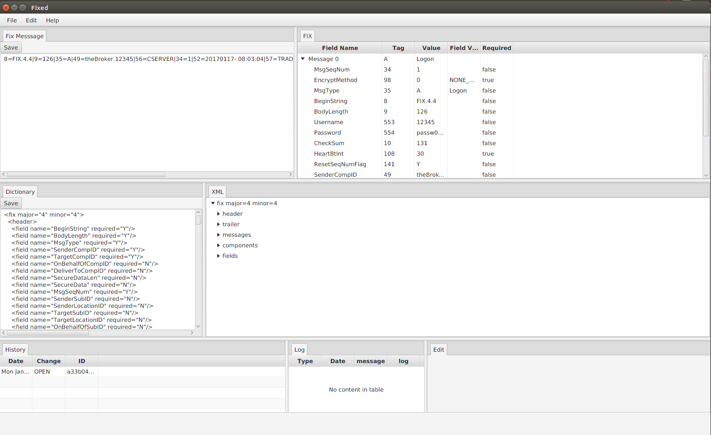

# Fix Editor

The tool is created for visualization of fix protocol messages based on given fix dictionary.

 

### Technology Stack
* JavaFX

### Libraries
* [Dom4J](https://dom4j.github.io/) is used for xml parsing

### Maven Build

mvn jfx:native

### Run

cd <ProjectHome>/fixed-ui/target/jfx/app
java -jar fixed-ui-1.0-SNAPSHOT-jfx.jar

